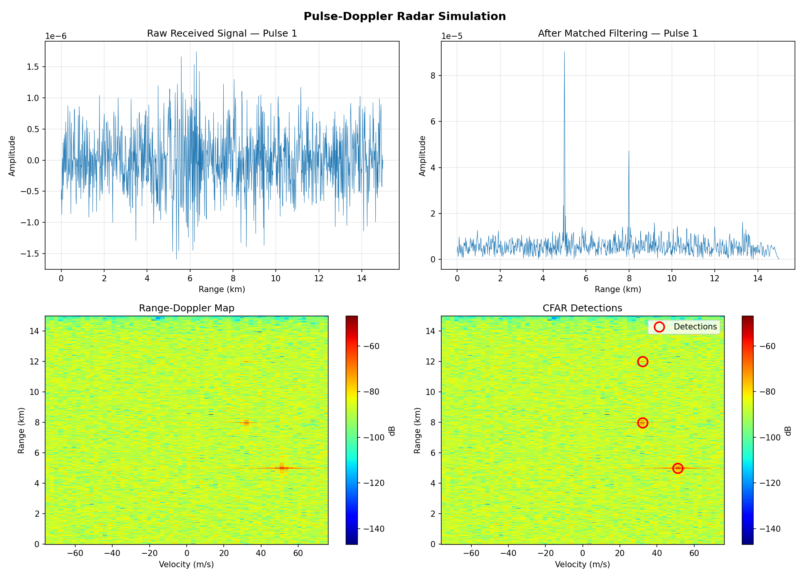

# Pulse-Doppler Radar Simulator

A C++ implementation of a pulse-Doppler radar signal processing chain, ported from MATLAB/Octave.

## Results



## Signal Processing Pipeline

1. **Chirp Generation** — Linear frequency modulated (LFM) transmit waveform
2. **Target Simulation** — Simulated returns with range delay, Doppler shift, and noise
3. **Matched Filtering** — Range compression via frequency-domain convolution
4. **Doppler Processing** — Velocity extraction via FFT across pulses
5. **CFAR Detection** — Constant false alarm rate target detection

## System Parameters

| Parameter              | Value     |
|------------------------|-----------|
| Carrier frequency      | 10 GHz (X-band) |
| Chirp bandwidth        | 5 MHz     |
| Pulse width            | 10 μs     |
| PRF                    | 10 kHz    |
| Pulses per CPI         | 64        |
| Range resolution       | 30 m      |
| Max unambiguous range  | 15 km     |

## Dependencies

- C++17 compiler (g++ or clang++)
- CMake 3.16+
- [Eigen3](https://eigen.tuxfamily.org/) — matrix operations
- [FFTW3](https://www.fftw.org/) — fast Fourier transforms
- Python 3 with numpy and matplotlib (for plotting)

## Build

```bash
sudo apt install build-essential cmake libfftw3-dev libeigen3-dev
pip install numpy matplotlib

mkdir build && cd build
cmake ..
make
```

## Run

```bash
# Create the output directory for CSV data
mkdir -p output

# Run the simulation
./build/radar_sim

# Generate the plot
python3 plot_results.py output
```

The simulator writes CSV files to the `output/` directory, which the Python script reads to produce the plot.

## License

MIT
